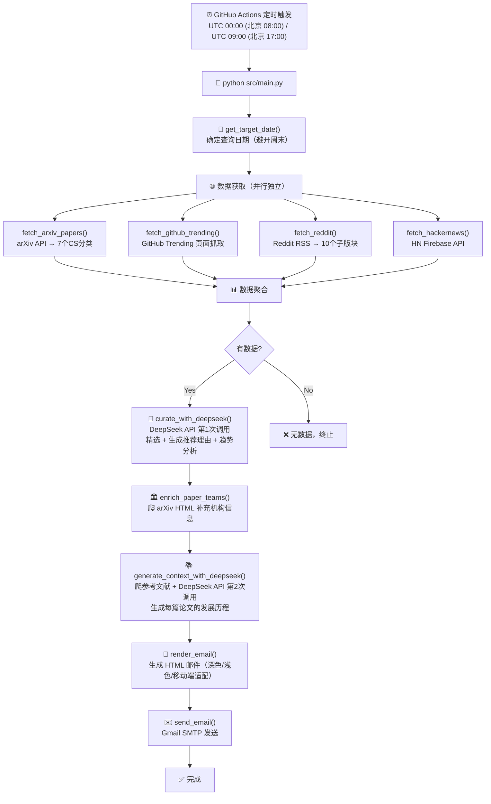
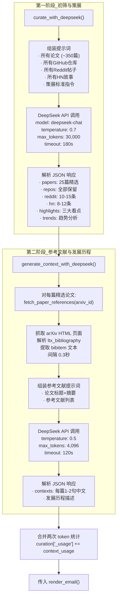
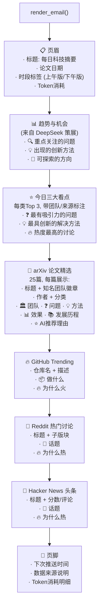
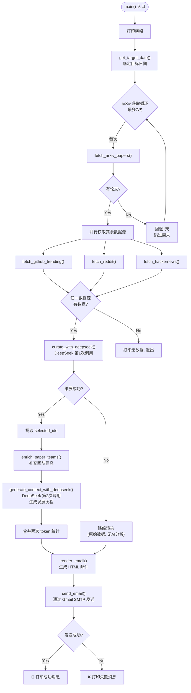
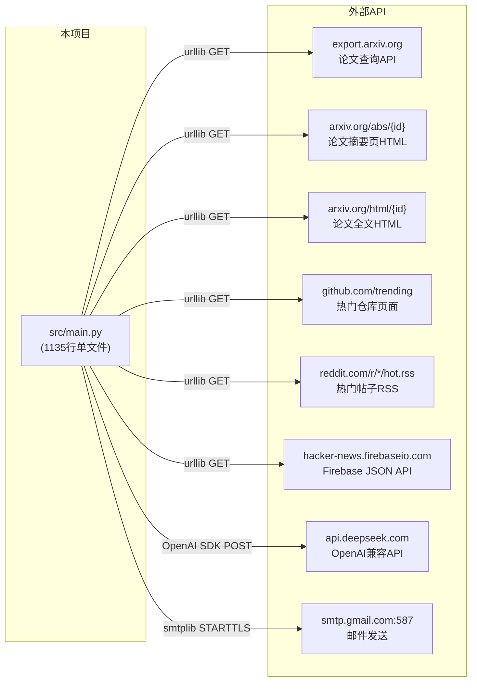

# 📋 每日科技摘要 — 代码流程图

## 1. 整体架构流程（高层视角）



## 2. 详细数据流

```mermaid
flowchart TD
    subgraph 调度层
        CRON["GitHub Actions Cron<br/>0 0 * * * (早8点)<br/>0 9 * * * (午5点)"]
    end

    subgraph 入口
        MAIN["main()"]
    end

    subgraph 日期模块
        DATE["get_target_date()<br/>→ 昨日起回溯4天<br/>→ 跳过周六日<br/>→ 返回 (YYYYMMDD, YYYY-MM-DD)"]
    end

    subgraph 数据获取层
        ARXIV["fetch_arxiv_papers(date, display)<br/>────────────────<br/>遍历 7 个分类<br/>→ arXiv API XML 查询<br/>→ 解析 Atom Feed<br/>→ 提取: 标题/摘要/作者/机构<br/>→ _check_known_team() 标记知名团队<br/>→ 按 arxiv_id 去重<br/>→ 最多回溯7天(无数据时)<br/>────────────────<br/>返回: list&#91;dict&#93;"]
        
        GITHUB["fetch_github_trending()<br/>────────────────<br/>→ 抓取 github.com/trending<br/>→ 正则提取仓库名+描述<br/>→ 去重, 最多15个<br/>────────────────<br/>返回: list&#91;dict&#93;"]
        
        REDDIT["fetch_reddit()<br/>────────────────<br/>→ Reddit RSS (10个子版块合并)<br/>→ 解析 Atom Feed<br/>→ 提取标题/链接/子版块/内容<br/>→ 最多30条<br/>────────────────<br/>返回: list&#91;dict&#93;"]
        
        HN["fetch_hackernews()<br/>────────────────<br/>→ Firebase API: topstories.json<br/>→ 取前15个ID<br/>→ 逐个获取 item/{id}.json<br/>→ 提取标题/URL/分数/评论数<br/>────────────────<br/>返回: list&#91;dict&#93;"]
    end

    subgraph AI策展层
        CURATE["curate_with_deepseek(papers, repos, reddit, hn)<br/>────────────────<br/>→ 构建多部分提示词<br/>&nbsp;&nbsp;· 所有论文(标题+作者+摘要前200字)<br/>&nbsp;&nbsp;· 所有GitHub仓库<br/>&nbsp;&nbsp;· 所有Reddit帖子<br/>&nbsp;&nbsp;· 所有HN故事<br/>&nbsp;&nbsp;· 精选标准指令<br/>&nbsp;&nbsp;· JSON输出格式要求<br/>→ DeepSeek API (OpenAI SDK)<br/>&nbsp;&nbsp;temperature=0.7, max_tokens=30000<br/>→ 解析JSON响应<br/>→ 返回精选结果 + token统计<br/>────────────────<br/>返回: dict{papers, repos, reddit, hn, highlights, trends, _usage}"]
    end

    subgraph 补充信息层
        ENRICH["enrich_paper_teams(papers, selected_ids)<br/>────────────────<br/>→ 对每篇精选论文<br/>→ 抓取 arxiv.org/abs/{id}<br/>→ 在 &lt;div class='authors'&gt; 中搜索<br/>→ 匹配知名机构列表<br/>→ 写入 paper&#91;'scraped_team'&#93;<br/>────────────────<br/>返回: papers (in-place修改)"]
        
        CONTEXT["generate_context_with_deepseek(papers, selected_ids)<br/>────────────────<br/>→ 对每篇精选论文<br/>&nbsp;&nbsp;fetch_paper_references(id)<br/>&nbsp;&nbsp;→ 抓取 arxiv.org/html/{id}<br/>&nbsp;&nbsp;→ 解析 &lt;section class='ltx_bibliography'&gt;<br/>&nbsp;&nbsp;→ 提取 bibitem 文本<br/>&nbsp;&nbsp;→ sleep(0.3s) 限速<br/>→ 构建参考文献提示词<br/>→ DeepSeek API 第2次调用<br/>&nbsp;&nbsp;temperature=0.5, max_tokens=4096<br/>→ 生成每篇论文的"发展历程"<br/>────────────────<br/>返回: dict{paper_id→context}, usage"]
    end

    subgraph 渲染与发送层
        RENDER["render_email(papers, repos, reddit, hn, curation, date, contexts)<br/>────────────────<br/>→ 确定时段标签(上午版/下午版)<br/>→ _resolve_team() 统一团队查找<br/>→ 生成HTML:<br/>&nbsp;&nbsp;1. 页眉(标题/日期/时段/token)<br/>&nbsp;&nbsp;2. 趋势与机会(3段中文)<br/>&nbsp;&nbsp;3. 三大看点(问题/方法/热议)<br/>&nbsp;&nbsp;4. arXiv论文精选(25篇)<br/>&nbsp;&nbsp;5. GitHub Trending<br/>&nbsp;&nbsp;6. Reddit热门讨论<br/>&nbsp;&nbsp;7. Hacker News头条<br/>&nbsp;&nbsp;8. 页脚(下次推送时间)<br/>→ 嵌入式CSS(深色/浅色/移动端)<br/>────────────────<br/>返回: (html_string, time_label)"]
        
        SEND["send_email(html, date, time_label)<br/>────────────────<br/>→ 构建 MIMEMultipart<br/>→ Gmail SMTP (587, STARTTLS)<br/>→ 发送至 EMAIL_TO<br/>────────────────<br/>返回: bool"]
    end

    CRON --> MAIN
    MAIN --> DATE
    DATE --> ARXIV
    MAIN --> GITHUB
    MAIN --> REDDIT
    MAIN --> HN
    
    ARXIV --> CURATE
    GITHUB --> CURATE
    REDDIT --> CURATE
    HN --> CURATE
    
    CURATE --> ENRICH
    ENRICH --> CONTEXT
    CONTEXT --> RENDER
    RENDER --> SEND
```

## 3. arXiv 论文获取子流程

```mermaid
flowchart TD
    START["fetch_arxiv_papers(date_str, date_display)"] --> LOOP{"遍历 7 个分类<br/>cs.AI, cs.LG, cs.CL,<br/>cs.CV, cs.DC, cs.OS, cs.SE"}
    
    LOOP --> QUERY["构造 arXiv API 查询<br/>cat:{cat}+AND+submittedDate:&#91;{date}..{next}&#93;<br/>max_results=500"]
    QUERY --> HTTP["GET export.arxiv.org/api/query"]
    HTTP --> PARSE["解析 Atom XML"]
    
    PARSE --> EXTRACT["提取每条 entry:<br/>· title (标题)<br/>· summary (摘要前500字)<br/>· id → arxiv_id<br/>· author name + affiliation<br/>· category terms"]
    
    EXTRACT --> CHECK["_check_known_team(affiliation)<br/>匹配知名机构列表<br/>(OpenAI, DeepMind, Stanford...)"]
    
    CHECK --> APPEND["添加到 all_papers list"]
    APPEND --> LOOP
    
    LOOP -->|遍历完成| DEDUP["按 arxiv_id 去重"]
    DEDUP --> RETURN["返回 unique papers"]
```



## 4. DeepSeek 双阶段调用流程



## 5. HTML 邮件渲染结构



## 6. main() 函数完整执行流程



## 7. 外部服务依赖总览



## 8. 关键数据结构

```mermaid
flowchart TD
    subgraph 论文对象
        PAPER["paper dict<br/>· title: str<br/>· summary: str (前500字)<br/>· arxiv_id: str<br/>· authors: list&#91;str&#93; (最多6人)<br/>· has_known_team: bool<br/>· categories: list&#91;str&#93;<br/>· primary_cat: str<br/>· scraped_team: str (后续补充)"]
    end

    subgraph 策展结果
        CURATION["curation dict<br/>· papers: list&#91;dict&#93; (25篇)<br/>· repos: list&#91;dict&#93;<br/>· reddit: list&#91;dict&#93;<br/>· hn: list&#91;dict&#93;<br/>· highlights: {problems, methods, buzz}<br/>· trends: {problems, methods, opportunities}<br/>· _usage: {prompt_tokens, completion_tokens, total_tokens}"]
    end

    subgraph 上下文映射
        CTX["contexts dict<br/>· key: paper_id (如 'P0')<br/>· value: 发展历程描述 (中文1-2句)"]
    end

    subgraph 邮件产物
        EMAIL["(html_string, time_label)<br/>· html: 完整HTML文档<br/>· time_label: '上午版' | '下午版'"]
    end
```


